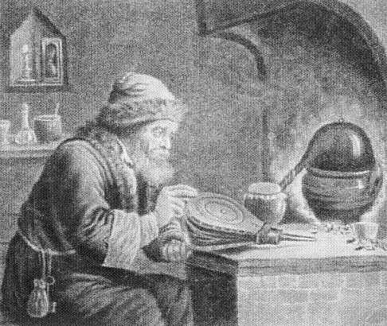

# Transforma: Code Generated Mappers



Transforma is a code generation tool that automates creation of entities mappers.  
For example: you receive DTOs from outer REST API and maps them to business logic models.

Mark fields with tag `trf:"field_name"` if need to map fields with different names.

## Usage

grab `transforma` utility

```bash
go get github.com/hardsky/transforma/cmd/transforma
```
check that $GOPATH/bin is added to your $PATH

Here are our entities that we want to map.

foo.go

```go
package anyNames

type Foo struct {
	Name string
}

type Bar struct {
	OtherName string `trf:"Name"`
}
```

Now, write skeleton functions for mappers, that we want to generate.

mapper.go

```go
// +build transforma

package anyNames

func mapperFooBar(f *Foo) *Bar {
	return &Bar{}
}

func mapperBarFoo(b *Bar) *Foo {
	return &Foo{}
}
```

run `transforma` in project root

as result you see `mapper_gen.go` file

```go
//+build !transforma

package anyNames

func mapperFooBar(f *Foo) *Bar {
	res := &Bar{}
	res.OtherName = f.Name
	return res

}

func mapperBarFoo(b *Bar) *Foo {
	res := &Foo{}
	res.Name = b.OtherName
	return res

}

```

If entities have same field name, that you dont need to use tags.

Notice, that mappers sketch file (mappers.go) is marked with build tag:

`// +build transforma`

It's guaranteed, that stub will not built in project executable.

Generated file contains opposite build tag:

`//+build !transforma`

It's needed for `transforma` tool, that it skips that file when analize package.

See tests for additional info (internal/transforma/test-data/).
